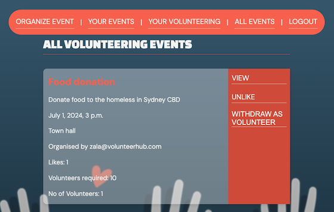
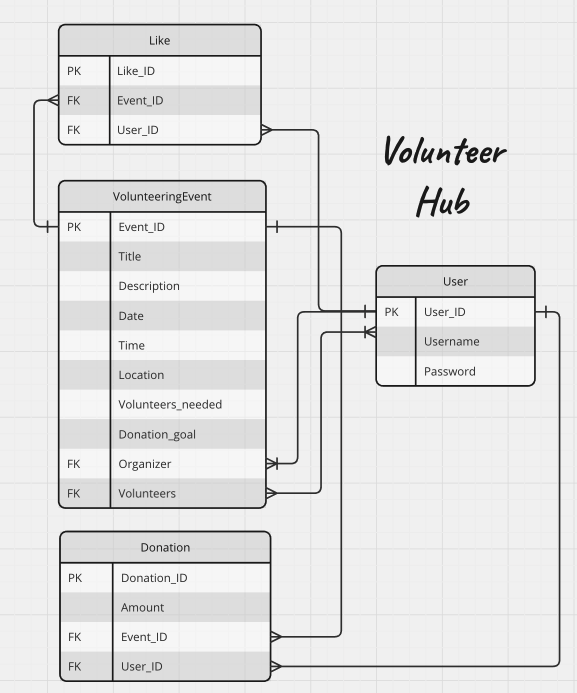

# VolunteerHub
A community volunteering event application where users can easily organise volunteering events, volunteer and donate, all in one place.

## URL

(https://volunteerhubz.onrender.com/)

## App image

## Wireframe

## Entity relationship diagram

## Technologies Used

- Python
- Django
- CSS
- PostgreSQL
- Render
- Trello board

## User Stories / MVP
As a user,

- I want to be able to sign up, log in and out of the application.
- Only logged in users to be able to see volunteering event information.
- I want to be able to volunteer for an event and withdraw as a volunteer from an event.
- I want to be able to like and unlike a volunteering event.
- I want to be able to easily see all the events I have volunteered for.
- I want to be able to see all the volunteering events that have been created, so I can volunteer for events that appeal to me.
- I want all lists of events to be displayed in date and time order.
- I want to be able to see how many people have volunteered for an event and the names of the volunteers.
- I want to be able to see the total number of people that have liked a volunteering event.
- I want to be able to create/organise a volunteering event.
- I want to be the only user that can edit and delete event(s) I have created.
- I want to be able to easily see all the events I have created/organised.
- I want to be able to donate (cash amount of my choice) to an event.
- I want to be able to see donation goal and amount raised for each event.
- I want to be able to set a donation goal for my event when creating an event.
- I want to be able to see the percentage completed for my donation goal.
- I want to not add/update volunteering events to a past date.

## Ice box

As a user,

- I want to see all volunteering events without needing to log in (but only signed-in users can volunteer).
- I want to receive notifications and reminders about volunteering events.
- I want to be able to connect with other volunteers using the application.
- I want to be able to provide comments on events.
- I want to see a map of the event location.
- I want to post photos from the volunteer events I attended.
- I want to be able to pay with Stripe or PayPal for donations.

## Team roles

- Github Manager: Zala
- Deployment: Zala
- Designer: Zala
- Database Manager: John
- Authentification and Authorization: John
- Documenter: Mutsumi
- Code: John, Zala, Mutsumi

## Pitch deck

(https://docs.google.com/presentation/d/1L4T_ubcK8NZy4TvZzVt9_93fR3nNefH0mmBN-HEA2gY/edit#slide=id.g274e5197dd6_1_39)

## Trello board
https://trello.com/b/7MWjfIRH/sprint-retrospective-template-trello
