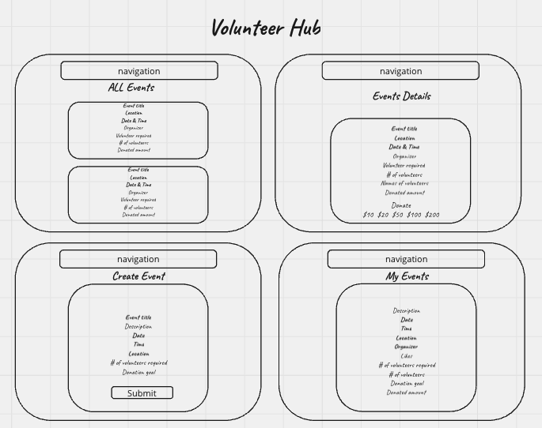

# VolunteerHub
A community volunteering event application where users can organise volunteering events and volunteer.

## URL

(Add link)

## App image

## Wireframe

## Entity relationship diagram

## Technologies Used

- Python
- Django
- CSS
- PostgreSQL
- Render
- Trello board

## MVP

- Log in/out feature
- Volunteering event information view available only for logged-in users
- Participating and withdrawing from an event
- Like/Unlike feature
- Event participation history for users
- Volunteering event list (date and time order)
- Event details view (number and names of volunteers)
- Volunteering event creation feature (edit/delete available only to organiser)
- List of volunteering evnets that the user created
- Event donation (cash) feature

## User Stories
As a user,

- I want to be able to sign up, log in and out of the application.
- Only logged in users to be able to see volunteering event information.
- I want to be able to volunteer for an event and withdraw as a volunteer from an event.
- I want to be able to like and unlike a volunteering event.
- I want to be able to easily see all the events I have volunteered for.
- I want to be able to see all the volunteering events that have been created, so I can volunteer for events that appeal to me.
- I want all lists of events to be displayed in date and time order.
- I want to be able to see how many people have volunteered for an event and the names of the volunteers.
- I want to be able to see the total number of people that have liked a volunteering event.
- I want to be able to create/organise a volunteering event.
- I want to be the only user that can edit and delete event(s) I have created.
- I want to be able to easily see all the events I have created/organised.
- I want to be able to decide to donate/not to donate to an event. I want to be able to select donation amount from choices.
- I want to see donated amount for an event in the all events list and event details.
- I want to be able to set a donation goal for my event when creating an event.
- I want to see donation goal and donated amount for the events that I organised.

## Ice box

As a user,

- I want to receive notifications and reminders about volunteering events.
- I want to be able to connect with other volunteers using the application.
- I want to be able to provide comments on events.
- I want to see a map of the event location.
- I want to post photos from the volunteer events I attended.

## Team roles

- Github Manager: Zala
- Deployment: Zala
- Designer: Zala
- Database Manager: John
- Documenter: Mutsumi
- Code: John, Zala, Mutsumi

## Pitch deck

(VolunteerHub - GA Unit 3 Project) \* Add link

## Trello board

https://trello.com/b/7MWjfIRH/sprint-retrospective-template-trello
